https://event-hub-frontend-30c8bbf9de26.herokuapp.com/

# Event Hub (Front-End)

  ## Introduction

The **Event Hub** is a front-end web application designed to showcase and manage live music events. This application serves as a user-friendly platform where music lovers can:

- Explore upcoming music events.

- Interact with other attendees through comments.

- Follow musicians and event organizers.

- Maintain personalized user profiles.

The project is connected to a separate **Django-based backend**, which handles:

- User authentication and role management.

- Event creation, modification, and retrieval.

- Commenting system.

- Profile and user data processing.

---

## Target Audience

**Event Hub** is designed for a diverse audience with a shared passion for music events. It caters to:

### 🎶 **Music Enthusiasts**

- Users looking for **upcoming music events**.

- Fans who want to **engage in discussions** and leave comments about events.

- Individuals who enjoy **following musicians**.

### 🎤 **Musicians**

- Artists who want to **showcase their talent** and connect with event organisers.

- Musicians looking for **gig opportunities** and event collaborations.

- Performers who want to **share their genre and instruments** with followers.

### 🎟️ **Event Organisers**

- Organisers who want to **create, manage, and promote events**.

- Event planners looking for **musicians to book for live performances**.

- Professionals seeking an easy-to-use **platform for event promotion**.

### 🌍 **General Public**

- Anyone interested in **exploring live music experiences**.

- Individuals who want to **engage with their favorite artists**.

- Users who appreciate a **centralised hub for music events**.

This platform is built to **bridge the gap** between music fans, artists, and event organizers, creating a **vibrant and interactive music community**.

---
  
## Table of Contents

- [Introduction](#introduction)

- [The Strategy Plane](#the-strategy-plane)

- [Site Goals](#site-goals)

- [Agile Planning](#agile-planning)

  - [Epics](#epics)

    - [User Stories](#user-stories)

- [The Structure Plane](#the-structure-plane)

  - [Features](#features)

    - [User Roles & Permissions](#user-roles--permissions)

    - [Navigation Menu](#navigation-menu)

    - [Home](#home)

    - [Events](#events)

    - [Comments](#comments)

    - [Profiles](#profiles)

- [Potential Future Features](#future-features)

- [The Skeleton Plane](#the-skeleton-plane)

  - [Wireframes](#wireframes)

  - [The Surface Plane](#the-surface-plane)

  - [Design](#design)

  - [Colour Scheme](#colour-scheme)

  - [Typography](#typography)

- [Technologies](#technologies)

- [Testing](#testing)

- [Deployment](#deployment)

- [Heroku Deployment](#heroku-deployment)

- [Version Control](#version-control)

- [Run Locally](#run-locally)

- [Forking](#forking)

- [Credits](#credits)

- [Content](#content)

---

## The Strategy Plane


### Site Goals

- Provide a dynamic and engaging platform for music lovers to discover events.

- Allow different types of users (Basic, Musician, Organiser) to interact uniquely.

- Offer event organizers tools to manage and promote their events.

- Enable musicians to view their upcoming and past performances.

- Ensure a responsive, intuitive UI with a seamless user experience.

### Agile Planning

The project follows an **Agile Development Process**, with a focus on:

- Iterative development through epics.
 

## Epics

### Epic 1: Navigation & Authentication

### Epic 2: Events

### Epic 3: Comments

### Epic 4: Home Page

### Epic 5: Profile

## User Stories

### Epic 1 - React: Navigation & Authentication - **Iteration 1**
1. **Navigation - Navbar**
2. **React: Navigation - Routing** _(Must Have)_
3. **React - Authentication - Sign Up** _(Must Have)_
4. **React: Authentication - Sign In** _(Must Have)_
5. **React: Authentication - User stays signed in on page refresh** _(Must Have)_
6. **React: Navigation - Navbar renders to reflect logged-in user's status** _(Must Have)_
7. **React Nav/Auth: A User can Sign out in the navbar to end their session** _(Must Have)_
8. **React: Profile - Add User roles with conditional rendering depending on role** _(Should Have)_
9. **React: Profile - Add basic profile pages** _(Must Have)_

---

### Epic 2 - React: Events - **Iteration 2**
10. **React: Event Creation Form** _(Must Have)_
11. **React: Filling Out Event Details** _(Must Have)_
12. **React: Uploading an Event Image** _(Should Have)_
13. **React: Assigning Musicians to an Event** _(Could Have)_
14. **React: Restricting Access to Event Creation Route** _(Must Have)_
15. **React: Displaying "Create Event" Link Based on User Role** _(Must Have)_
16. **Optimizing User Experience with Loading States** _(Should Have)_
17. **React: Event list** _(Must Have)_
18. **React: Infinite scroll** _(Must Have)_
19. **React: Event search and filter** _(Could Have)_
20. **React: Like Event Feature** _(Wont Have)_


---

### Epic 3 - React: Comments - **Iteration 3**
21. **React: Add comment to event** _(Must Have)_
22. **React: Edit a Comment** _(Must Have)_
23. **React: Delete a Comment** _(Must Have)_
24. **React: View Comments for an Associated Event** _(Must Have)_
25. **React: Like Comment Feature** _(Wont Have)_

---

### Epic 4 - React: Home Page - **Iteration 3**
26. **React: Landing Page for Not-Signed-In Users** _(Must Have)_
27. **React: Landing Page for Signed-In Basic Users** _(Should Have)_
28. **React: Landing Page for Signed-In Musicians** _(Should Have)_
29. **React: Landing Page for Signed-In Organisers** _(Should Have)_
30. **React: Event Carousel** _(Should Have)_

---

### Epic 5 - React: Profile - **Iteration 3**
31. **React: Display Basic Profile Information** _(Must Have)_
32. **React: Display Musician Profile Details** _(Could Have)_
33. **React: Display Organiser Profile Details** _(Must Have)_
34. **React: Profile Management & Editing** _(Must Have)_
35. **React: Follow/Unfollow Users** _(Could Have)_

## Wont Have

20. **React: Like Event Feature** _(Wont Have)_
25. **React: Like Comment Feature** _(Wont Have)_

### Reasons
- The Like Feature was low down in terms of priority, and towards the end of my deadline i had to cut some of my tasks left to do down, i came to the conclusion that the likes feature, compared to my other features that still needed to be created, was less important, and also harder to make unique to the walkthrough's "Like" feature.

- One possible way I could have made it unique to the walkthrough would be to change the like model to a track model, allowing the user to track events, and have access to a page listing their tracked events. This would have made more sense for an event discovery platform, as it could have been expanded to have allowed users to save get updates on their tracked events when the organiser updates it, or when the event is nearing its due date, or when an event has happened.
 Navigate to [Potential Future Features](#future-features) section to see more about **Track Event** Feature.

## The Structure Plane

## Features

**Event Hub** offers a range of features tailored to different user roles: **Basic, Musicians, and Organizers**. Below are the key functionalities:

### 🎨 **UI & Navigation**
- **Favicon & Logo**: A recognizable branding identity across all pages.
- **Navbar**: Provides quick navigation to key areas like events, profile, and authentication options.


### 🏡 **Landing Page (Home)**
The landing page dynamically changes based on the user's authentication and role:
- **Not Signed In**: 
  - Call-to-action (CTA) to **sign in / sign up**, and to **view events**.
  - Sliding carousel of **events**.
  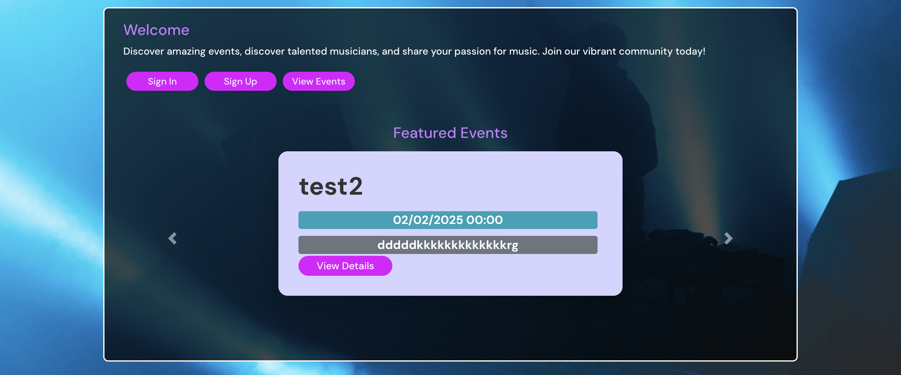
- **Signed In Role: Basic User**:
  - CTAs to **upgrade account** links to **edit profile form**.
  - Sliding carousel of **events**.
  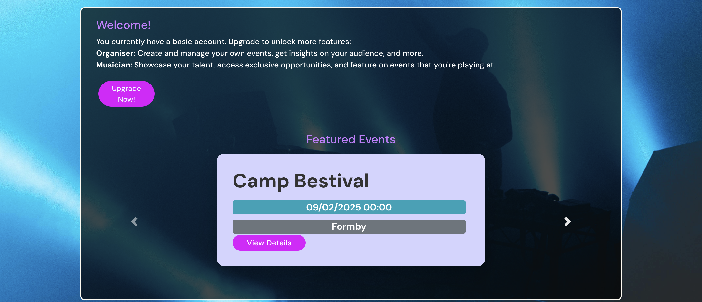
- **Signed In Role: Musician**:
  - CTAs to **view profile** and **explore events**.
  - Sliding carousel displaying **events the musician is tagged in**.
  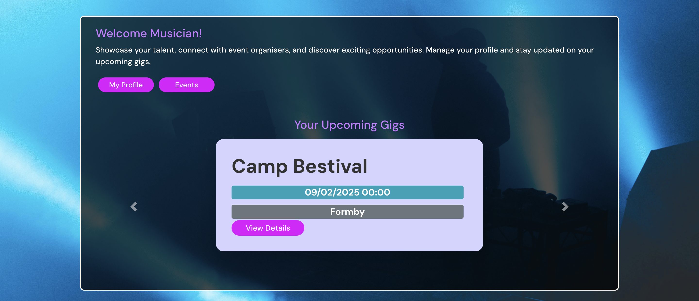
- **Signed In Role: Organizer**:
  - CTAs to **create a new event** and **view profile**.
  - Carousel displaying **events** created by the user.
  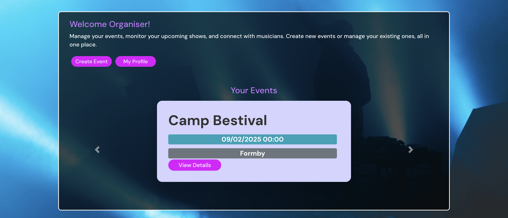

- **Event Carousel:** Displays **a minimized version of events**, showing only:
  - **Title**
  - **Date**
  - **Location**
  - **CTA** to view event detail

### **Events**
- **Events Page**:
  - Displays a **list of events**.
  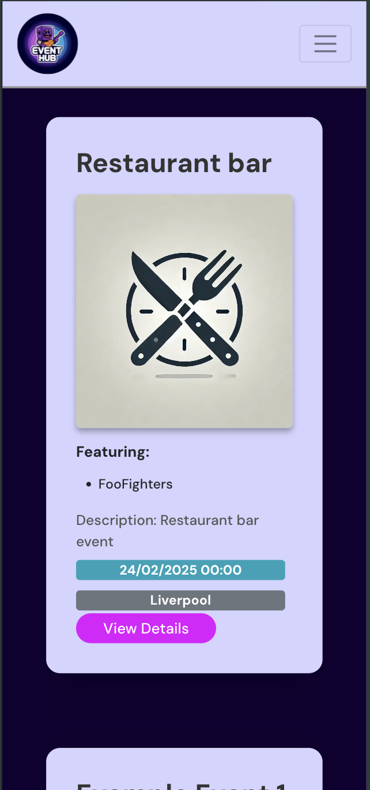
  - Filter options:
    - **Location**
    - **Musician(s)**
    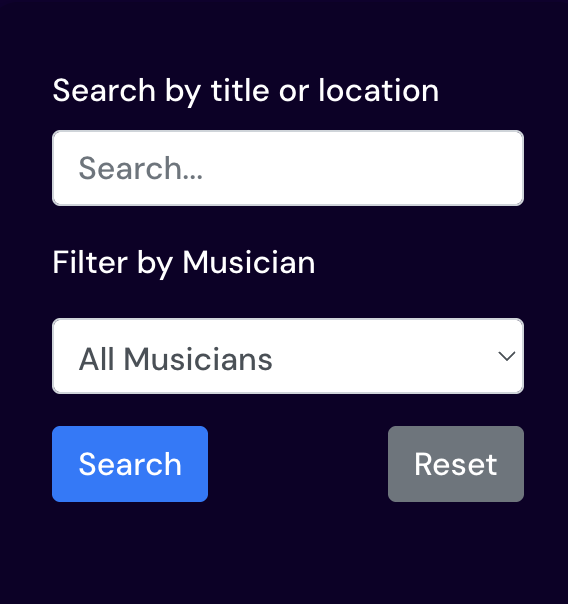
- **Create Event**:
  - Fields:
    - **Image**
    - **Title**
    - **Description**
    - **Date/Time**
    - **Musicians** (can tag profiles with **role** of **musician**)
    - **Location**
    
- **Event Detail Page**:
  - Full event details and interactions.
  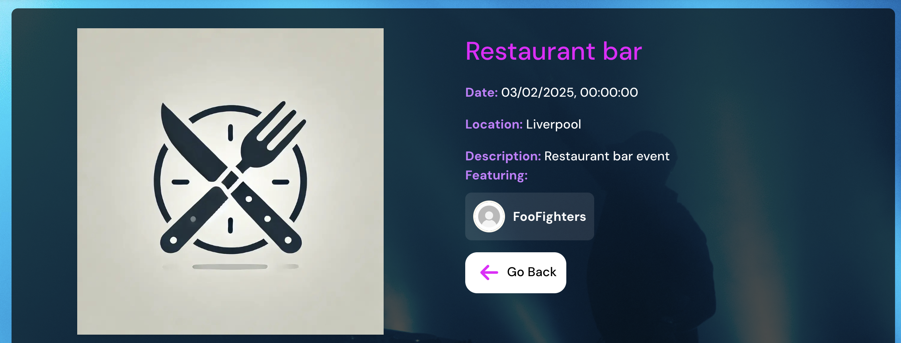
  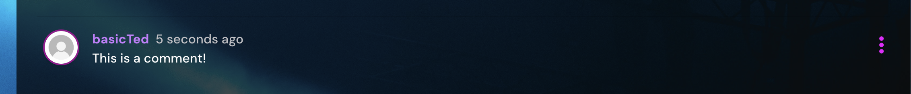
- **Edit Event**:
  - Users with **organizer role** can update **events** that they are the owner of.
  - Fields:
    - **Image**
    - **Title**
    - **Description**
    - **Date/Time**
    - **Musicians** (can update tagged musicians)
    - **Location**
    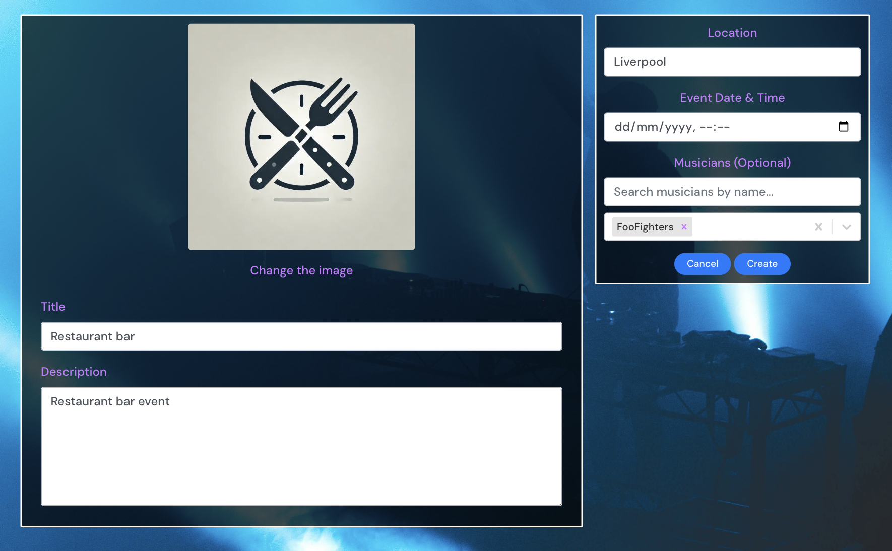
- **Delete Event**:
  - Organizers can remove their events.

### 💬 **Interactions**
- **Commenting System**:
  - **Add a comment** to an event.
  - **Edit a comment** (only the owner of the comment can edit).
  - **Delete a comment** (only the owner of the comment can delete).
  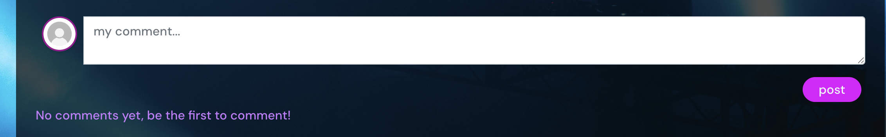
  
  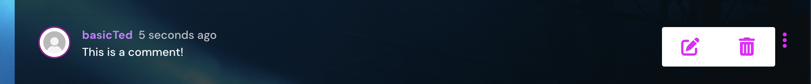
- **Follow System**:
  - Users can **follow/unfollow** other users.
  
  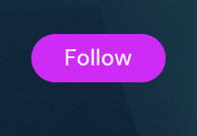
### **User Profiles**
- **Basic Profile**:
  - Displays:
    - **Full Name** ( Set to blank on sign up )
    - **Bio** ( Set to blank on sign up )
    - **Joined date**
    - **Followed users count**
    - **Followers count**
    - **User role**
    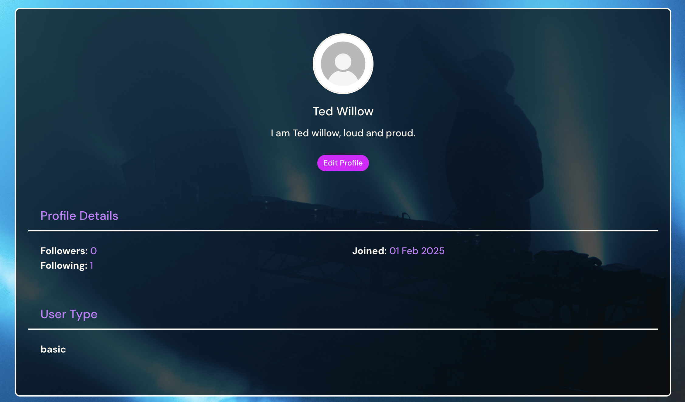

- **Musician Profile**:
  - Includes **all basic profile fields** plus:
    - **Upcoming & past tagged events**.
    - **Musician details**:
      - **Genre**
      - **Instruments**
    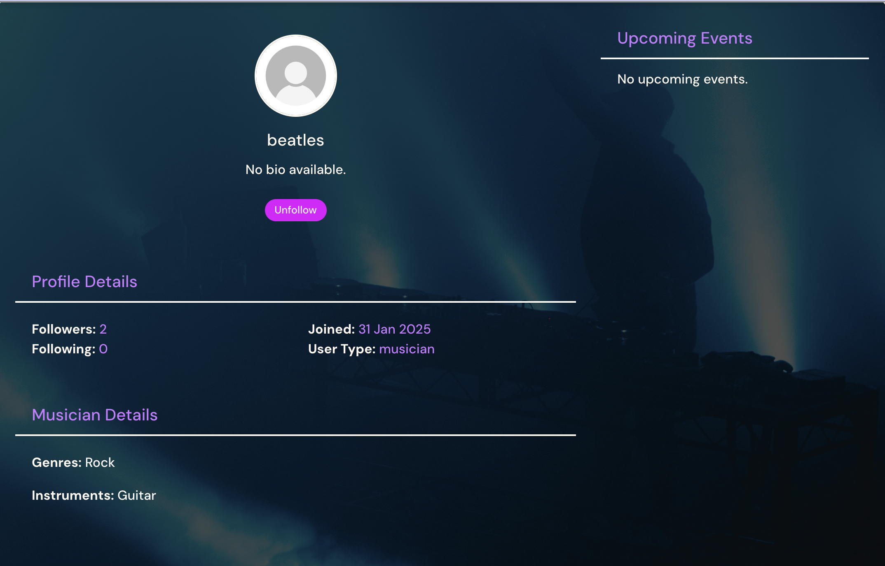
- **Organizer Profile**:
  - Includes **all basic profile fields** plus:
    - **Upcoming events created**.
    - **Past events created**.
  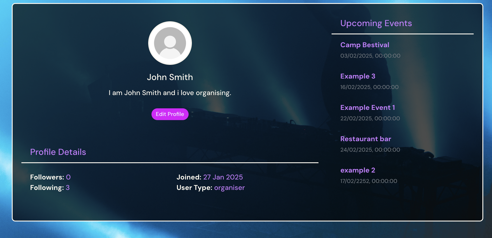
### 🔧 **Profile Management**
- **Edit Profile**:
  - Fields:
    - **Full Name**
    - **Bio**
    - **Change Profile Image**
    - **Upgrade User Role** (only if the role is **Basic**).
    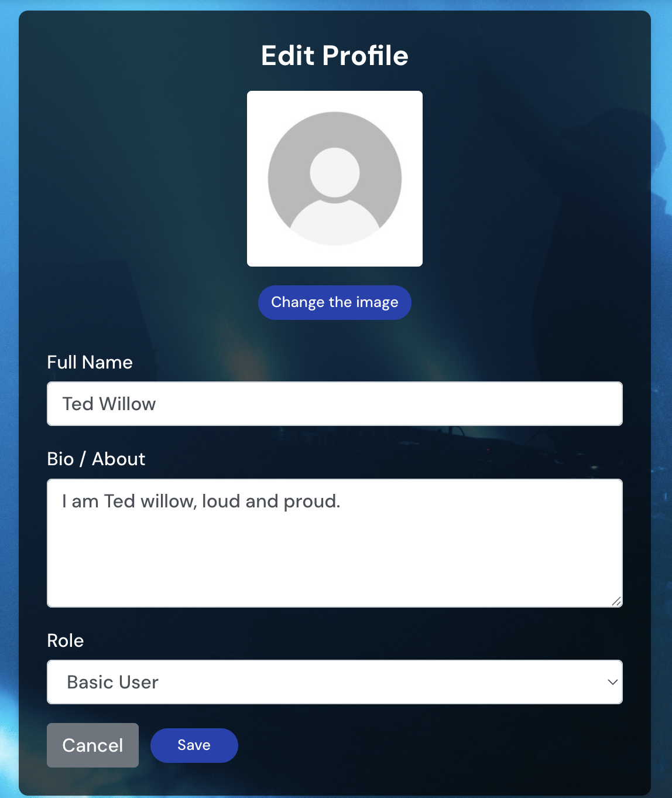
    
**renders:** **Genre** and **Instruments** field for users with role of musician.
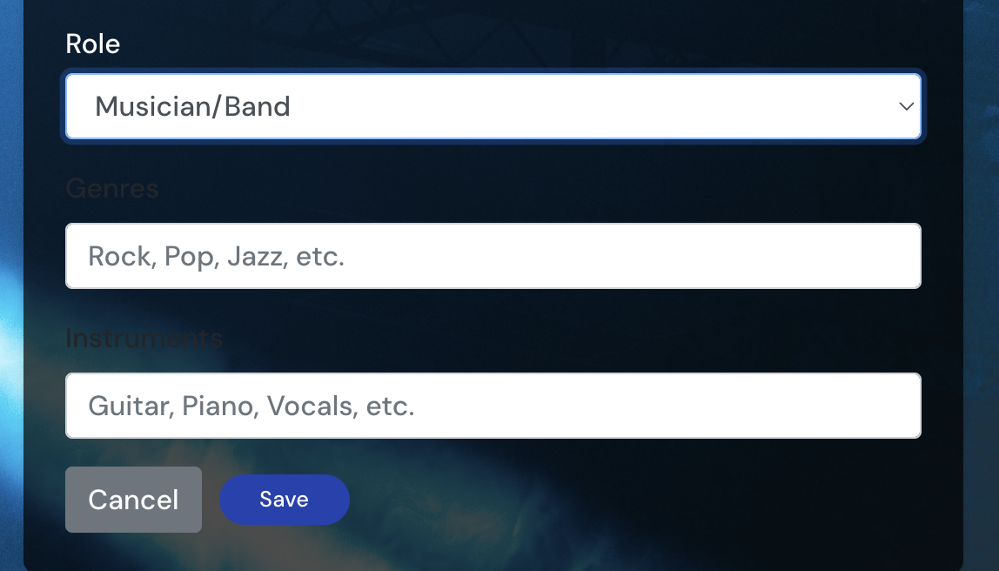
---  

## User Roles & Permissions

The system includes **three user roles** with unique permissions:

### 1. **"basic" (Default Role)**

✅ Can:

- Browse events.

- Follow other users.

- Comment on events.

❌ Cannot:

- Create or edit events.
- Be tagged in events
- Upgrade account more than once.
  
### 2. **"musician"**

✅ Can:

- Perform all actions of a **Basic User**.

- Be tagged in events by organisers.

- See a **list of past and upcoming events** they are performing at.

- Fill out **"Genre"** and **"Instruments"** fields on their profile.

❌ Cannot:

- Create or edit events.

### 3. **"organiser"**

✅ Can:

- Perform all actions of a **Basic User**.

- Create, edit, and delete events.

- Tag musicians in their events.

- View a **list of past and upcoming events** they have created.

  ❌ Cannot:

- Be tagged in events by organisers.
---

## Navigation Menu

The site will have a **navigation bar** that includes:
- **Logo**

- **Home**

- **Events**

- **Create Event** (Only for Organisers)

- **Logout** (if logged in) / **Sign in**, **Sign Up** (if logged out) 

- **Profile**  (if logged in)

---

## Potential Future Features

- **Social Media Integration:** Share events on social platforms.

- **Live Chat:** allows users to chat in real time, this would work well with **Apply to play at an Event:** potential feature as it could allow the organiser to interact with the musicians playing at the event, enabling them to coordinate specifics in app, as oposed to using an external service.

- **Event Ratings & Reviews:** Users can rate past events.

- **Apply to play at an Event:** Musicians can fill out a contact form which when filled out will send an email to the owner of the event they are applying to play at. To play at an event ( Feature in it ), the organiser has to accept the application Which would then automatically set the musician feature on the even.

- **Track Event:** Users can Track events.


## Potential Future Implementation Detailed: "Track Event" Feature  

### Overview  
The **Track Event** feature would allow users to save and manage events they are interested in. This would enhance the event discovery experience by providing personalized reminders, event updates, and an easy way to revisit tracked events.

### Core Features  
1. **Tracked Events Page** – A dedicated section where users can view and manage their tracked events.  
2. **Event Updates & Notifications**  
   - **Organizer Updates** – Users receive notifications when an organizer modifies event details (e.g., time, location).  
   - **Event Reminders** – Automated alerts as the event date approaches.  
3. **Personalized Event Recommendations** – Users receive event suggestions based on their tracking history eg, if they have tracked events with a specific musician being featured at it more than once, than it will recommend more events with that musician tagged.  
4. **Social Engagement** – Users can see which events their friends are tracking.  


## The Skeleton Plane

### Wireframes

Wireframes were created to visualize the user interface before development.

---

### The Surface Plane  

#### **Design**  
The application features a modern, sleek, and intuitive design, prioritizing user-friendliness and accessibility. Clean layouts, structured navigation, and responsive elements ensure a seamless experience across all devices.  

#### **Colour Scheme**  
A thoughtfully curated color palette enhances usability and engagement. The design incorporates a positive and inviting theme, with vibrant accent colors that improve readability and highlight key elements without overwhelming the user.  

#### **Typography**  
The application utilizes Google Fonts to achieve a balance between style and readability. The font choices complement the overall design, ensuring clear, aesthetically pleasing text presentation across all sections.

---

## Technologies

- **Frontend:** HTML, CSS, JavaScript, React

- **Backend:** Django (connected via API)

- **Database:** PostgreSQL

- **Styling:** Bootstrap, CSS

- **Version Control:** Git, GitHub

- **Deployment:** Heroku

---

## Testing

### Test Case: Updating Profile with Musician Fields

**Title:**

Basic User Upgrading to Musician – Validate Inclusion of Musician Fields

**Objective:**

Verify that when a basic user changes their role to "musician" and submits the profile form with musician-specific fields (i.e., "genres" and "instruments"), the update is successful and the musician fields are stored and returned in the API response.

**Pre-requisites:**

- The user must be logged in as a basic user.

- The profile edit UI is accessible.

**Test Steps:**

1. **Log In as a user with role of "basic"**

- Log in to the application with a basic user account.

- Ensure that the user’s current role is "basic".

2. **Navigate to Profile Edit Page**

- Open the profile edit form where the user’s current information is loaded from the backend.

3. **Change Role to Musician**

- In the role selection dropdown, change the role from "basic" to "musician".

- *(Note: This field is enabled only for users with a "basic" role.)*

4. **Enter Musician-Specific Information**

- Fill in the musician-specific fields:

- **Genres:** e.g., "Rock, Jazz"

- **Instruments:** e.g., "Guitar, Piano"

5. **Submit the Form**

- Click the "Save" button to submit the updated profile information.

6. **Inspect the API Response**

- Using developer tools or an API client (like Postman), confirm that the API response includes the updated profile data.

- Check for the following:

- The **role** field is now set to "musician".

- The **genres** and **instruments** fields contain the values entered.

- The response includes all expected fields for a musician profile.

7. **Verify Backend**

- Refresh the profile view or perform a GET request on the profile endpoint to ensure that the musician fields are permanently stored and returned correctly.

**Expected Result:**

- The profile update should be successful.

- The returned profile data must include the role as "musician" and display the musician-specific fields (**genres** and **instruments**).

- The UI and API response should reflect the changes correctly.

### Actual Result (Before the Fix)

The old `get_serializer_class` method was implemented as follows:

```python
def get_serializer_class(self):
    """
    Return a serializer without musician-specific fields for non-musicians.
    """
    profile = self.get_object()
    if profile.role != 'musician':
        class NonMusicianProfileSerializer(ProfileSerializer):
            class Meta(ProfileSerializer.Meta):
                fields = [
                    field for field in ProfileSerializer.Meta.fields
                    if field not in ['genres', 'instruments']
                ]
        return NonMusicianProfileSerializer
    return ProfileSerializer
```

- **Issue**:
  This implementation only checked the profile’s current role (via self.get_object()) and did not consider the incoming update data.

  As a result, when a basic user attempted to change their role to "musician" along with filling in genres and instruments, the serializer used during the PUT request excluded those fields.

  Consequently, only the role changed while the musician-specific fields were omitted.

- **Solution Implemented**
I updated the get_serializer_class method to distinguish between PUT (update) requests and GET requests.
The new method first checks the incoming request data for PUT requests.

```python
def get_serializer_class(self):
    # For edit/update requests, check the role in the incoming data.
    if self.request.method == 'PUT':
        if self.request.data.get('role') == 'musician':
            return ProfileSerializer
        else:
            # Otherwise, use a serializer without musician-specific fields.
            class NonMusicianProfileSerializer(ProfileSerializer):
                class Meta(ProfileSerializer.Meta):
                    fields = [
                        field for field in ProfileSerializer.Meta.fields
                        if field not in ['genres', 'instruments']
                    ]
            return NonMusicianProfileSerializer

    # For GET requests (and any other non-PUT requests), use the current profile role.
    profile = self.get_object()
    if profile.role != 'musician':
        class NonMusicianProfileSerializer(ProfileSerializer):
            class Meta(ProfileSerializer.Meta):
                fields = [
                    field for field in ProfileSerializer.Meta.fields
                    if field not in ['genres', 'instruments']
                ]
        return NonMusicianProfileSerializer

    return ProfileSerializer
```

The serializer now checks self.request.data for the role value.
If the incoming role is "musician", the full ProfileSerializer (which includes genres and instruments) is returned.
Otherwise, a modified serializer that excludes these fields is used.
For GET (and other) requests:

The current profile role (from self.get_object()) is used to determine which serializer to return.
Outcome
With the updated method:

When a basic user changes their role to "musician" and provides musician-specific information, the full serializer is used during the PUT request.
This ensures that the musician fields are included in both the response and the saved profile data.
Conclusion
After redeploying the backend with the updated get_serializer_class method, I re-ran the test.

✅ The profile now correctly updates the role to "musician" and includes the genres and instruments fields in the response.

✅ The updated musician information persists, confirming that the solution works as expected.

---

### Manual Test Case: Ensure Comments Are Unique to Their Event

**Objective:**

Verify that a comment created on one event is displayed **only** on that event and **not** on any other.

**Test Steps:**

1. **Create a Comment on Event A**

- Go to the detail page for Event A.

- Create a new comment.

- Confirm that the comment appears on Event A's page.

2. **Check a Different Event**

- Navigate to the detail page for Event B (or any event other than Event A).

- Verify that the comment from Event A is **not displayed** on Event B's page.

**Expected Result:**

- The comment should **only appear on Event A** and must **not** show up on Event B.

**Actual Result (Before Fix):**

- Comments were **not filtered by event**, meaning comments from Event A were also displayed on Event B.

**Solution Implemented:**

- The issue was resolved by integrating the **Django Filter Backend** into the Comments API, which now filters comments based on the event ID.

**Outcome:**

- After deploying the fix, comments are now correctly associated with their respective events, ensuring that they **do not appear on unrelated event pages**.

---

# Test Cases for Event Hub

Each test case follows this structure

- **Test ID:** Unique identifier for the test.

- **Description:** The purpose of the test.

- **Steps:** Step-by-step instructions to perform the test.

- **Expected Result:** What should happen if the feature works correctly.

- **Actual Result:** The outcome of the test.

- **Pass/Fail Status:** Whether the test was successful.

---

## Test Case: Ensure Event List Displays All Events

- **Test ID:** TC001

- **Description:** Ensure the event list page returns all events.

- **Steps:**

1. Navigate to **Event Hub**.

2. Go to the **Events** page.

3. Verify that all events are displayed in order of newest first.

- **Expected Result:** All events should be displayed in descending order by date (newest first).

- **Actual Result:** As expected.

- **Status:** ✅ **PASS**

---

## Test Case: Ensure Event Detail Page Opens on Click

- **Test ID:** TC002

- **Description:** Ensure that clicking on event "View Details" button, or the event image opens the event detail page.

- **Steps:**

1. Navigate to **Event Hub**.

2. Click on any event in the event list.

3. Verify that the event detail page loads with all fields displayed.

- **Expected Result:** The event detail page should open and display all relevant event information.

- **Actual Result:** As expected.

- **Status:** ✅ **PASS**

---

## Test Case: Ensure Only Organizers Can Create Events

- **Test ID:** TC003

- **Description:** Ensure that only users with the **organiser** role can create events.

- **Steps:**

1. Navigate to the **Create Event** page.

2. If the user is **not** an organiser, verify that the "Create Event" option is disabled.

3. If the user **is** an organiser, create a new event and submit it.

4. Verify that the event is added successfully.

- **Expected Result:** Only organisers should be able to create events.

- **Actual Result:** As expected.

- **Status:** ✅ **PASS**

---

## Test Case: Ensure Comments Stay Unique to Their Events

- **Test ID:** TC004

- **Description:** Ensure that a comment made on an event appears **only** on that event.

- **Steps:**

1. Navigate to **Event A**.

2. Add a comment.

3. Navigate to **Event B**.

4. Verify that the comment from **Event A** does **not** appear on **Event B**.

- **Expected Result:** Comments should only be displayed on the event they were posted on.

- **Actual Result:** As expected.

- **Status:** ✅ **PASS**

---

## Test Case: Ensure Basic Users Can Upgrade to Musician Role

- **Test ID:** TC005

- **Description:** Ensure that basic users can successfully upgrade to a musician profile.

- **Steps:**

1. Log in as a **basic user**.

2. Navigate to the **Edit Profile** page.

3. Change the role to **"musician"**.

4. Fill in musician-specific fields (**Genres** and **Instruments**).

5. Submit the form.

6. Check the API response and profile page.

- **Expected Result:** The user’s profile should update with the new role and musician-specific fields.

- **Actual Result:** As expected.

- **Status:** ✅ **PASS**

---

## Test Case: Ensure Only One Role Upgrade is Allowed

- **Test ID:** TC006

- **Description:** Ensure that users can only upgrade their account **once**.

- **Steps:**

1. Log in as a **basic user**.

2. Upgrade to **musician**.

3. Try to upgrade again to **organiser**.

4. Verify that the upgrade option is no longer available.

- **Expected Result:** Users should be able to upgrade **only once**.

- **Actual Result:** As expected.

- **Status:** ✅ **PASS**

---

## Test Case: Ensure Musicians Can See Their Tagged Events

- **Test ID:** TC007

- **Description:** Ensure that musicians can see a list of events they have been tagged in.

- **Steps:**

1. Log in as a **musician**.

2. Navigate to the **Profile Page**.

3. Verify that the **Upcoming Events** and **Past Events** sections list the correct events.

- **Expected Result:** The musician’s profile should display events they have been tagged in.

- **Actual Result:** As expected.

- **Status:** ✅ **PASS**

---

## Test Case: Ensure Event Organisers Can Tag Musicians

- **Test ID:** TC008

- **Description:** Ensure that event organisers can tag musicians in their events.

- **Steps:**

1. Log in as an **organiser**.

2. Navigate to **Create/Edit Event**.

3. Use the musician selection field to tag musicians.

4. Save the event.

5. Verify that the musician is correctly listed in the event details.

- **Expected Result:** The event should display the tagged musician(s).

- **Actual Result:** As expected.

- **Status:** ✅ **PASS**

---

## Test Case: Ensure Profile Page Displays Correct Role Information

- **Test ID:** TC009

- **Description:** Ensure that user profiles correctly display their role (Basic, Musician, Organiser).

- **Steps:**

1. Log in as any user.

2. Navigate to the **Profile Page**.

3. Verify that the role is displayed correctly.

- **Expected Result:** The profile page should show the correct user role.

- **Actual Result:** As expected.

- **Status:** ✅ **PASS**


#  Negative Tests

## Test Case: Attempting to Create an Event Without Required Fields
- **Test ID:** NEG001
- **Description:** Ensure that an event cannot be created without filling all required fields.
- **Steps:**
  1. Log in as a user with the **organizer** role.
  2. Navigate to the **Create Event** page.
  3. Leave the **title, description, or date fields** blank.
  4. Attempt to submit the form.
- **Expected Result:** The event creation fails, and an error message prompts the user to fill in the required fields.
- **Actual Result:**✅ PASS
---
## Test Case: Attempting to Create an Event as a Non-Organizer
- **Test ID:** NEG002
- **Description:** Ensure that users without the **organizer** role cannot create events.
- **Steps:**
  1. Log in as a **basic user** or **musician**.
  2. Try to navigate to the **Create Event** page manually.
  3. Attempt to submit an event.
- **Expected Result:** The system prevents event creation and redirects to home page.
- **Actual Result:** ✅ PASS
---
## Test Case Part 1: Attempting to Edit Another User’s Event as an organiser.
- **Test ID:** NEG003 
- **Description:** Ensure that organisers can only edit events they have created.
- **Steps:**
  1. Log in as an **organizer**.
  2. Navigate to an event created by another organizer.
  3. Try to edit the event.
- **Expected Result:** The system should **prevent editing** and redirect to an 403 error page stating **forbidden action** with a redirect CTA back to home page.
- **Actual Result:** 
- User was unable to submit the post request, and a 403 **error** was displayed in the ** console log**.
- **Solution:** 
- Create a new folder in pages called errors, create a "ForbiddenPage.js" file, in handle submit for the event edit logic, if error status is equal to 403, then redirect user to forbidden page.
- in app.js add new route.
**Perform Test Again**:
- **Expected Result:** The system should **prevent editing** and redirect to an 403 error page stating **forbidden action** with a redirect CTA back to home page.
- **Actual Result:** ✅ PASS

## Test Case Part 2: Attempting to Edit An Organisers Event as a user with a role not equal to organiser.

- **Test ID:** NEG003 
- **Description:** Ensure that organisers can only edit events they have created.
- **Steps:**
  1. Log in as an user with a **role** that is not equal to "organiser".
  2. Navigate to an event edit page.
  3. Try to edit the event.
- **Expected Result:** The system should **prevent editing** and redirect to an 401 error page stating **Unauthorised action** with a redirect CTA back to home page.
- **Actual Result:** 
- User was unable to submit the post request, instead was returned a console error of 401
-  **Solution:** 
- Create a new folder in pages called errors, create a "UnauthorisedPage.js" file, in handle submit for the event edit logic, if error status is equal to 401, then redirect user to Unauthorised page.
- in app.js add new route.
**Perform Test Again**:
- **Expected Result:** The system should **prevent editing** and redirect to an 401 error page stating **Unauthorised action** with a redirect CTA back to home page.
- **Actual Result:** ✅ PASS

---

## Test Case: Entering Invalid Date/Time Format in Event Creation
- **Test ID:** NEG004
- **Description:** Ensure that invalid date/time formats are not accepted when creating or editing an event.
- **Steps:**
  1. Log in as an **organizer**.
  2. Navigate to the **Create Event** page.
  3. Enter an **invalid date/time format** (e.g., `35/14/2025`).
- **Expected Result:** The field **rejects invalid dates/times**.
- **Actual Result:** The field **rejects invalid dates/times**, and sets the field to the date/time closest to the user input eg, user user inputs 35 into the days field, the field will set it to 31, which is the closest possible date.
- After noting this i tested what the day field would be set to if it was a month which didn't have 31 days, like February, which only has 28 days.
- **Result**: The Days field is still set to 31, however, when the user attempts to submit the event data, with the month set to Feb (02), and the days set to (31), the field throws an invalid date error.
- **Note**: 
The result wasn't what I expected, but I believe it still improves the user experience.
- **Status:** ✅ PASS

---

## Test Case: Entering an Extremely Long Event Title
- **Test ID:** NEG005
- **Description:** Ensure that the event title has a **maximum character limit**.
- **Steps:**
  1. Log in as an **organizer**.
  2. Navigate to the **Create Event** page.
  3. Enter a title with an **Excessive  amount of characters**.
  4. Submit the form.
- **Expected Result:** The system should **reject the submission** and display a message about the character limit.
- **Actual Result:** When characters are less than 200 event can be created successfully. This then displays the full title which if longer than 25 characters will overflow.
- If title is over 200 characters user is given an error. 
- - **Status:** ❌ FAIL
- **Notes**: Inside the events model, the title field is set a max length of 200 characters, however since titles with char length of over 25, cause page overflow, it is too large of a limit.
- **Solution**: I set a max length of 25 for event title fields in create and edit, and inside of eventDetail page, I wrapped the display title element in a styled div to keep it within its space.
- **Status:** ✅ PASS
---
## Test Case: Posting an Empty Comment
- **Test ID:** NEG006
- **Description:** Ensure that users cannot submit an empty comment.
- **Steps:**
  1. Log in as any user.
  2. Navigate to an **event page**.
  3. Submit a comment without entering any text.
  4. Edit an existing comment and make it empty.
- **Expected Result:** The user is **unable** to submit the comment.
- **Actual Result:** he user is **unable** to submit the comment.
- **Status:** ✅ PASS
---
## Test Case: Editing Another User’s Comment
- **Test ID:** NEG007
- **Description:** Ensure that users can only edit their own comments.
- **Steps:**
  1. Log in as a **user**.
  2. Navigate to an **event with comments**.
  3. Try to edit a comment posted by another user.
- **Expected Result:** The user is unable to interact with any comments not owned by them, other than to view the profile of its creator.
- **Actual Result:** The user is unable to interact with any comments not owned by them, other than to view the profile of its creator.
- **Status:** ✅ PASS
---
## Test Case: Following the Same User Multiple Times
- **Test ID:** NEG008
- **Description:** Ensure that a user cannot follow the same person multiple times.
- **Steps:**
  1. Log in as any user.
  2. Navigate to another user’s profile.
  3. Click **Follow** multiple times.
- **Expected Result:** The system should **prevent duplicate follows**.
- **Actual Result:**  The system **prevents duplicate follows**.
- **Status:** ✅ PASS
---

## Test Case: Attempting to Upgrade Role More Than Once
- **Test ID:** NEG009
- **Description:** Ensure that users can only upgrade their role **once**.
- **Steps:**
  1. Log in as a **basic user**.
  2. Navigate to the **Edit Profile** page.
  3. Upgrade to **musician** or **organizer**.
  4. Try upgrading again.
- **Expected Result:** The system should **block further role changes** after the first upgrade.
- **Actual Result:** The system **blocks further role changes** after the first upgrade.
- **Status:** ✅ PASS

---

## Test Case: Attempting to Tag a Non-Musician as a Performer
- **Test ID:** NEG010
- **Description:** Ensure that only users with the **musician** role can be tagged as event performers.
- **Steps:**
  1. Log in as an **organizer**.
  2. Create or edit an event.
  3. Try tagging a **basic user** as a musician.
- **Expected Result:** The organiser is only able to see users with a role of musician in the musicians field.
- **Actual Result:** The organiser is only able to see users with a role of musician in the musicians field.
- **Status:** ✅ PASS

---

## Test Case: Uploading an Image Larger Than the Allowed Limit
- **Test ID:** NEG011
- **Description:** Ensure that image uploads are restricted to the **maximum file size limit**.
- **Steps:**
  1. Log in as any user.
  2. Navigate to the **Edit Profile** or **Create Event** or **Edit Event** page.
  3. Attempt to upload an image **larger than 2MB**.
- **Expected Result:** The system **rejects the file** and displays an error message about the size limit.
- **Actual Result:**  The system **rejects the file** and displays an error message about the size limit.
- **Status:** ✅ PASS

---

## Test Case: Logging In with Incorrect Credentials
- **Test ID:** NEG012
- **Description:** Ensure that users cannot log in with incorrect email/password.
- **Steps:**
  1. Navigate to the **login page**.
  2. Enter an **incorrect email/password combination**.
  3. Attempt to log in.
- **Expected Result:** The system **denies access** and displays an error message.
- **Actual Result:** The system **denies access** and displays an error message.
- **Status:** ✅ PASS

### Responsiveness

All pages were tested to ensure responsiveness across screen sizes starting from **320px and upwards**, in accordance with the **WCAG 2.1 Reflow criteria** for responsive design. Testing was conducted on **Chrome**.

### Testing Steps:

1. Open a browser and navigate to **Event Hub**.
2. Open Developer Tools (**Right-click → Inspect**).
3. Enable **Responsive Mode** and set the width to **320px**.
4. Adjust the **zoom to 50%** for better visibility.
5. Click and drag the responsive window to its **maximum width**.

### Expected Behavior:

- The website adapts to all screen sizes **without pixelation or stretching** of images.
- No **horizontal scrolling** is present.
- No **overlapping elements** occur.

### Actual Results:

- The website **behaved as expected** across all tested screen sizes.

Additionally, the website was tested on various **physical devices**, and no responsiveness breaks were observed.
- Iphone 11
- Samsumg galaxy S10
- Macbook air 


### Eslint: 
-**Eslint** was installed and configured to iterate through my files, returning warnings and errors, the majority of the errors returned were single qoutes used instead of double quotes, indentation and white space, some characters needed chagning to html character entitys eg, `&quot;`.
final errors were left, as they had no effect on functionalty or where from files automatically generated on react app creation.

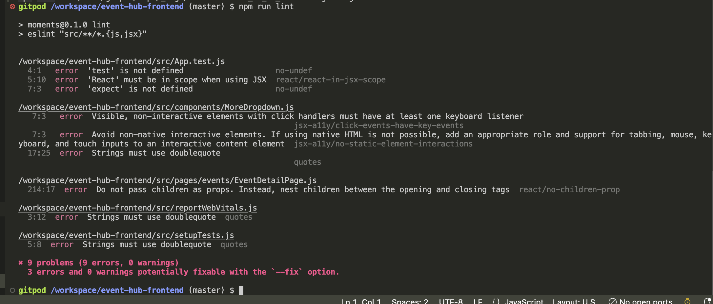


# Deployment

### Version Control


The **Event Hub Frontend** project was developed using **Gitpod** as the IDE, with Git for version control, and the code was stored in a remote GitHub repository.


Throughout development, the following Git commands were used to manage and push code updates:
-  **`git add <file>`**

Adds the specified file(s) to the staging area, preparing them for a commit.

-  **`git commit -m "commit message"`**

Commits the changes in the staging area to the local repository with a descriptive message.

-  **`git push`**

Pushes all committed changes from the local repository to the remote repository on GitHub.


### Heroku Deployment

The **Event Hub** site was deployed to Heroku, a cloud platform that allows easy deployment and scaling of web applications. Follow these steps to deploy the project on Heroku:

1. **Set Up Heroku**
   - Go to [Heroku](https://www.heroku.com/) and create an account (or log in if you already have one).
   - In your Heroku dashboard, click the **New** button in the top right corner and select **Create New App**.
   - Choose an **App Name** (it must be unique across Heroku) and select the appropriate **Region** based on your location.
   - Click **Create App**.

2. **Deploy with GitHub Integration**
   - Go to the **Deploy** tab and scroll down to **Deployment method**.
   - Under **Connect to GitHub**, click **Connect** and authorize Heroku to access your GitHub account if prompted.
   - In the search box, find the repository you want to deploy, then click **Connect** to link it to Heroku.

3. **Deploy the Application**
   - In the **Manual deploy** section, select the **main** branch and click **Deploy Branch**.
   - Heroku will begin building and deploying your app. Once completed, a message should confirm that the app was successfully deployed.
   - Click **View** to open your live site.

The application should now be live on Heroku! This setup provides a scalable and reliable environment for your Django project.
